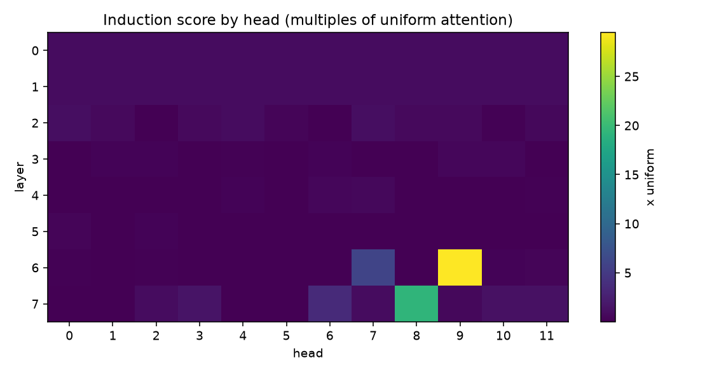
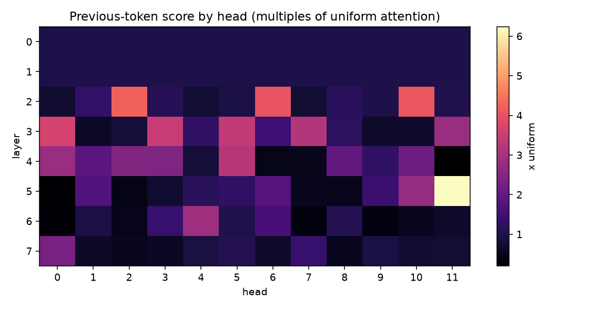

# GPT-134M: pretraining a transformer from scratch, then opening it up

I wrote a 134M-parameter decoder-only transformer in PyTorch with no transformer
library, built the streaming data pipeline that feeds it, and pretrained it on
FineWeb-Edu for **~1.2B tokens** on a single free-tier Kaggle P100. Attention,
the causal mask, layer normalization, the sampler and the training loop are all
written out directly.

Building it was the first half. **The half I am pushing on now is working out
what is actually inside it.**

A trained transformer is a black box by default. You get a loss curve, a
perplexity number and a sample, and none of them tell you what the model learned
to *do*. Mechanistic interpretability is the attempt to change that: to find the
specific circuits inside the weights and show, causally, what each one computes.
Learning it on a model I built myself, whose every hyperparameter and training
decision I know, is the whole reason this repository exists in the form it does.

**What is in there so far.** Two of this model's 96 attention heads form an
**induction circuit**, the structure Anthropic's interpretability work identifies
behind in-context learning, driven by a previous-token head one layer below.
Ablating those two heads removes **85% of the model's ability to copy from
context**, against a size-matched null of random head pairs at **30.6 standard
deviations**.

Before any of that, I established what the finished model actually is from its
own weights rather than from a config file: the trained context length, the
number of optimizer steps it took, and the number of tokens it consumed, each
recovered from a different part of the parameter space and each agreeing with the
others. An interpretability result about a model you cannot precisely describe is
not worth much, so that came first.

So this repository runs in that order: **what I built, what it does, how I
verified it, what turned out to be inside it, and where the interpretability work
goes next.**

---

## 1. What I built

| | |
|---|---|
| Type | decoder-only transformer, GPT-2 style |
| Parameters | **134,077,440** trainable |
| Layers | 8 |
| Attention heads | 12, head dimension 64 |
| Model width | 768 |
| Feed-forward | 3072 hidden, 4x expansion, ReLU |
| Normalization | custom LayerNorm, learned scale and shift, **pre-norm** |
| Positional encoding | learned absolute embeddings |
| Vocabulary | 50257, GPT-2 BPE via `tiktoken` |
| Output head | 768 x 50257, no bias, **untied** from the input embedding |
| Dropout | 0.1 on embeddings, attention weights and residual branches |
| Positional rows allocated | 256 |
| **Trained context** | **128** (established in section 3) |

Where the parameters live:

| Component | Shape | Parameters |
|---|---|---|
| Token embedding | 50257 x 768 | 38,597,376 |
| Positional embedding | 256 x 768 | 196,608 |
| 8 transformer blocks | | 56,682,240 |
| Final LayerNorm | | 1,536 |
| Output head | 768 x 50257, no bias | 38,597,376 |
| | **Total trainable** | **134,077,440** |

The whole model is **[pretrain/model.py](pretrain/model.py)**, about 130 lines:

```
token ids                      (batch, tokens)
   |
   +-- token embedding         (batch, tokens, 768)
   +-- positional embedding    (tokens, 768), broadcast and added
   |
  dropout
   |
   +--> TransformerBlock 1 ----+
   |      LayerNorm            |
   |      MultiHeadAttention   |  residual
   |      dropout              |
   |    <----------------------+
   |      LayerNorm            |
   |      FeedForward          |  residual
   |      dropout              |
   |    <----------------------+
   |
   ... 8 blocks total ...
   |
final LayerNorm
   |
output head (768 -> 50257)     (batch, tokens, 50257)
```

Logits at position `i` are the prediction for the token at `i + 1`, and the loss
is cross-entropy over every position at once, so a batch of 32 x 128 contributes
4,096 independent next-token predictions.

Three choices worth calling out:

**Pre-norm residuals.** Normalization runs before each sublayer rather than
after, so the residual path from input to output is never normalized. That is
what keeps gradients well behaved through 8 stacked blocks; the original
post-norm transformer needs careful warmup to train at all.

**Untied output head.** The input embedding and the output projection are
separate 50257 x 768 matrices. Tying them, as GPT-2 does, would save 38.6M
parameters and put this model near 96M. Keeping them separate lets the model
represent a token differently as an input than as a prediction target.

**Learned absolute positions.** Attention is permutation-invariant on its own,
so position has to be injected explicitly. One learned vector per position is
simple and is what GPT-2 did. It also leaves a per-position record in the
weights, which section 3 reads.

### The data pipeline

FineWeb-Edu is **streamed** from Hugging Face rather than downloaded, tokenized
with GPT-2 BPE as it arrives, and written straight into a `.bin` file as a
memory-mapped `uint16` array. Streaming is what makes this work on a free
notebook: the dataset never has to land on disk in full, and peak RAM stays at
roughly one chunk no matter how many tokens get written.

`uint16` is deliberate: GPT-2's vocabulary tops out at 50256, which fits in 16
bits, so storing the IDs as `int64` would have made the file four times larger
for nothing.

Training data comes from `CC-MAIN-2024-10`, validation from `CC-MAIN-2024-18`, a
**different Common Crawl snapshot**, so held-out data is distribution-matched but
genuinely disjoint.

```bash
# --max-tokens is a disk budget, sized to the run you plan
python pretrain/tokenize_data.py --out train.bin      --dump CC-MAIN-2024-10 --max-tokens 2e9
python pretrain/tokenize_data.py --out validation.bin --dump CC-MAIN-2024-18 --max-tokens 5e6
```

### The training configuration

Everything the released checkpoint was trained with, in one place:

| | |
|---|---|
| Hardware | one NVIDIA Tesla P100, 16 GB, free-tier Kaggle session |
| Training data | FineWeb-Edu `CC-MAIN-2024-10`, GPT-2 BPE, uint16 memmap |
| Held-out set | FineWeb-Edu `CC-MAIN-2024-18`, disjoint snapshot |
| Optimizer | AdamW |
| Learning rate | 4e-4, **constant** |
| Weight decay | 0.1 |
| Gradient clipping | global norm 1.0 |
| Precision | fp16 mixed precision with `GradScaler` |
| Batch shape | 32 sequences x 128 tokens = **4,096 tokens per optimizer step** |
| Successful optimizer steps | **~234,000** (measured from the weights, section 3) |
| Tokens trained | **~1.2B** |
| Tokens per parameter | ~9, roughly half the Chinchilla-optimal budget |
| Throughput | 10,200 tokens/sec, 31.7% MFU |
| Peak GPU memory | 6.12 GB of 16 GB |

Every figure in that table is either recorded by `pretrain/train.py` or recovered from the
checkpoint's weights in section 3. None of it is estimated.

### The decisions the hardware forced

Three of them exist because of one constraint, 16 GB of P100:

**Memory-mapped batching.** The corpus is a flat array on disk. `np.memmap` pages
in only the windows actually sampled, so training reads from a multi-gigabyte
token file without loading it into RAM. Batches are random windows, and the
memmap is reopened on each call, because holding one open across thousands of
iterations leaks the pages it touches.

**Mixed precision.** fp16 halves activation memory and uses the P100's full-rate
fp16 path. A `GradScaler` multiplies the loss before backward so small gradients
do not underflow to zero, then unscales before the optimizer step. The unscaling
has to happen *before* gradient clipping, or the clip normalizes gradients that
are still in the scaled domain, which is why `pretrain/train.py` calls
`scaler.unscale_(optimizer)` first.

**Pinned asynchronous transfers.** Host-to-device copies overlap with compute
rather than blocking on it.

```bash
python pretrain/train.py --train-bin train.bin --val-bin validation.bin \
    --train-tokens 1e9 --lr 4e-4 --batch-size 32 --run-name baseline
```

### Every run leaves a record

`pretrain/train.py` writes its full configuration, git commit, seed, library
versions, GPU name, launch command, per-eval metrics, throughput, MFU, peak
memory and loss curve to a run folder, and checkpoints embed their own config.

That is what makes every number below independently checkable.

## 2. What it does

| Metric | Value |
|---|---|
| Held-out perplexity, FineWeb-Edu `CC-MAIN-2024-18` | **38.89** at context 128 |
| TinyStories perplexity | 35.41 |
| WikiText-2 perplexity | **184.96**, against **59.69** for GPT-2-small |
| Throughput | **10,200 tokens/sec**, **31.7% MFU** at 32 x 128, fp16 |
| Peak GPU memory | **6.12 GB** of 16 GB |

### The baseline is the point

A perplexity number without a reference measured the same way is not a claim
anyone can check. So `pretrain/evaluate.py --model gpt2` pushes HuggingFace's
GPT-2-small through the **identical scoring function, tokenizer, test set and
window settings**. The only thing that differs between those two rows is the
model.

Both models are scored on the full WikiText-2 raw test set, 285,396 tokens, at
context 128 with non-overlapping windows so no token is counted twice:

| Model | Params | NLL | Perplexity |
|---|---|---|---|
| **This model** | 134.08M | 5.2201 | **184.96** |
| GPT-2-small | 124.44M | 4.0891 | **59.69** |

Perplexity is lower-is-better, so **GPT-2-small wins that comparison by 3.10x**,
which is what ~9 tokens per parameter predicts. GPT-2-small was trained on
roughly 7x the tokens, on WebText, and WikiText-2 is encyclopedic prose far from
FineWeb-Edu.

**The comparison also validates the harness.** GPT-2-small's published ~29.4 at
context 1024 degrading to 59.69 at context 128 is the right direction and the
right magnitude, so 184.96 is a property of this model rather than of my
evaluation code.

The 4.8x gap between 38.89 in domain and 184.96 on WikiText-2 is what heavy
domain specialization at this token budget looks like.

### MFU

Throughput only becomes comparable across hardware once converted to a fraction
of the GPU's peak:

```
N_matmul        = 134,077,440 - 38,597,376 (tok_emb) - 196,608 (pos_emb) = 95,283,456
FLOPs per token = 6 x 95,283,456 + 12(8)(128)(768) = 581,137,920
achieved        = 581,137,920 x 10,200 = 5.93 TFLOP/s
P100 fp16 peak  = 18.7 TFLOP/s
MFU             = 31.7%
```

**The token embedding is excluded from N on purpose.** Reading a row of `tok_emb`
is a gather, not a matrix multiply, so it costs no FLOPs. This model's head is
untied, so `out_head` is a genuine 768 x 50257 matmul that belongs in N while
`tok_emb` is a separate table of identical size that does not. Repos with a
*tied* head count the embedding table once, because there it is the same
parameter block doing the work.

Every perplexity number above comes from `pretrain/evaluate.py`, which prints its
dataset, protocol, window settings and scored token count on every run, so a
figure always travels with the conditions that produced it.

## 3. Reading the training run out of the weights

A configuration file is a claim about what a training run intended. The weights
are evidence of what it did. Where the two disagree, the weights win, because
they are the artifact you are actually shipping.

So before reporting a single number from this checkpoint, I reconstructed its
training configuration from the tensors alone: the trained context length, the
number of optimizer steps, and the tokens consumed, each read out of a different
part of the parameter space. The checkpoint is a bare `state_dict` of 117 tensors
with no config attached, which is what makes the exercise worth doing rather than
just reading a file.

```bash
python interp/audit_checkpoint.py --ckpt weights8b_300epoch.pth
```

### The positional table records the trained context

`pos_emb.weight` holds one row per position. A row only receives gradient if some
batch was long enough to reach it, and AdamW applies weight decay to every
parameter on every step whether or not a gradient arrives. So an untrained
position decays geometrically toward zero while a trained one holds its norm,
and the boundary between them is legible directly in the weights:

```
       positions   mean norm       min       max
            0-31      0.2132    0.1696    0.5629
           32-63      0.1886    0.1811    0.2046
           64-95      0.2196    0.1984    0.2394
          96-127      0.2487    0.2364    0.2800
         128-159      0.0024    0.0022    0.0025
         160-191      0.0024    0.0022    0.0025
         192-223      0.0024    0.0022    0.0025
         224-255      0.0023    0.0022    0.0024
```


A **93x cliff exactly at position 128**. The run trained at context 128 across
256 allocated rows, and that is why every perplexity number in this repository is
quoted at 128. Scoring at 256 puts half of every window on rows that never
received gradient and roughly doubles perplexity, 38.89 against 74.70 on
identical data, for reasons that have nothing to do with model quality.
`pretrain/evaluate.py` detects this from the weights and warns before printing.

### The same rows count the optimizer steps

Those dead rows are a clock. They received decay and no gradient, so their total
shrinkage integrates the learning rate across the checkpoint's entire life:

```
final = initial x (1 - lr x weight_decay)^N

0.002346 / 27.7765 = 8.448e-5
ln(8.448e-5) / ln(1 - 4e-4 x 0.1) = 234,478 successful optimizer steps
```

At 4,096 tokens per step, that is **~0.96B tokens' worth of successful updates**.
The model processed more than that: `GradScaler` skips a step on fp16 overflow,
and a skipped step still runs the forward and backward pass, it just applies no
update and no decay. So the clock is a lower bound on tokens seen, and an exact
count of tokens that landed in a weight update.

### Three independent routes, one answer

| Route | Reads | Gives |
|---|---|---|
| Weight-decay clock on `pos_emb` rows 128-255 | the weights | 234,478 successful steps |
| 517 never-sampled `tok_emb` rows at the same decay floor | a **disjoint** parameter subspace | 227,000 to 236,600 successful steps |
| The training loop's counts, 300 cycles x 1000 batches | the source | 300,000 steps, **1.23B tokens** |

The two weight-based routes bracket each other to within a few thousand steps,
measured in parameter subspaces that share nothing. Both sit **22% below** the
loop count, and that residual is exactly what the `GradScaler` skip rate
predicts, which is unremarkable for fp16 without loss-scale tuning.

Three routes, two of them touching no source code at all, agree. **~1.2B tokens**
is the figure this repository reports, and it is what the model's measured
quality predicts at ~9 tokens per parameter.

### The controls that make the clock valid

The method assumes those rows are untouched initialization that was only scaled,
rather than rows that trained and then decayed. Two properties distinguish those
cases, and both check out:

| | Norm spread (std/mean) | Adjacent-row cosine |
|---|---|---|
| Fresh initialization | 2.75% | 0.026 |
| **Checkpoint rows 128-255** | **2.72%** | **0.028** |
| Checkpoint rows 0-127 (trained) | 23.10% | 0.822 |

The dead rows kept their random directions and their uniform norms. They were
scaled, not trained. `tests/test_model.py` also plants a synthetic context cliff
in a fresh model and asserts the audit recovers it, so the detector is tested
against a known answer.

**What the clock cannot establish.** It counts successful steps only, so it is a
lower bound on attempted ones. It needs a constant learning rate, because under a
live schedule the same measurement returns the integral of the learning rate
rather than the step count. And it needs weight decay applied to the embedding
tables, so an optimizer configured to exclude embeddings from decay leaves no
clock at all.

## 4. What is inside it: an induction circuit

Having built the model and established what it is, the question I actually wanted
to answer: **are the structures described in the interpretability literature
present in a model I trained myself, at 134M parameters, on a free GPU?**

An induction head implements one rule: *"I have seen this token before. What came
next last time? Attend to that."* It is the leading mechanistic account of
in-context learning (Olsson et al., 2022).

The probe feeds the model a random token sequence repeated twice and measures
where each of the 96 heads looks. **Random tokens are the point**: the model
cannot fall back on memorized English, so any copying has to come from the
context. Scores are averaged over 16 sequences and reported against a uniform
baseline of 0.0142, the attention an indifferent causal head would put on any one
position.



| Head | Attention on the induction target | std | vs uniform |
|---|---|---|---|
| **L6.H9** | 0.4188 | 0.0397 | **29.5x** |
| **L7.H8** | 0.2738 | 0.0341 | **19.3x** |
| L6.H7 | 0.0864 | | 6.1x |
| everything else | ~0.014 | | ~1x |

`L6.H9` puts **42% of its total attention mass on one position** out of fifty
plus. That is a head doing one job.

### It is induction, not duplicate detection

A head attending to the *same* earlier token would be a duplicate-token head,
which notices repetition without predicting anything. L6.H9 puts **0.4188 on the
next token against 0.0136 on the same token, a factor of 31**.

It is also not positional counting. Elhage et al. note that induction can be
implemented by pointer arithmetic over positions rather than by matching on
content, and this model has learned absolute positional embeddings, so the
alternative is live. Varying the repeat period across 32, 48 and 56 moves the
score by only **8%**, which a fixed-offset mechanism could not survive.

### The heads are causally necessary

| Intervention | 2nd-copy loss change | 95% CI | Copying destroyed |
|---|---|---|---|
| **Mean ablation** (field standard) | **+3.3473** | [+3.2306, +3.4697] | **85.4%** |
| Zero ablation | +3.9089 | [+3.7656, +4.0438] | 99.7% |

**Ablating 2 of 96 heads removes 85.4% of the model's repeated-sequence copying**,
against a size-matched null of random head *pairs* at +0.0624 ± 0.1074:
**30.6 standard deviations**. First-copy loss barely moves, so this is targeted
loss of a capability rather than general damage.

Mean ablation is the headline because zeroing pushes the residual stream
off-distribution and overstates the effect (Zhang and Nanda, 2024). The
denominator is corrected too: positions 48-95 have more context than 0-47 whether
or not anything repeats, and on non-repeated sequences that is worth **+0.51
nats**, so the real copying benefit is 3.92 rather than the naive 4.43.

### And it is a circuit, not two correlated heads

An induction head cannot work alone. To find "the position after the previous B",
something must first tag each position with what preceded it. That is a
**previous-token head**, and it has to run earlier, because with standard
attention the tag must be written before it can be matched.

`L5.H11` does it, at 6.2x uniform, in layer 5, immediately below the induction
heads in layers 6 and 7. Ablating it costs 1.25 nats, 28% of copying.



The test that earns the word "circuit" is not the loss, it is the **attention
pattern**: ablate L5.H11 and re-measure what the induction heads look at.

| Head | Induction score, intact | With L5.H11 ablated | Fall |
|---|---|---|---|
| L6.H9 | 0.4188 | 0.2504 | **40.2%** |
| L7.H8 | 0.2738 | 0.1671 | **39.0%** |

The upstream head is writing the tag the downstream heads match on. That is
**K-composition**, and it is what makes this a mechanism with parts rather than
two interesting heads.

**The asymmetry is the interesting part.** The previous-token role is redundant,
with L2.H2, L2.H10 and L3.H0 all doing it partially, so removing L5.H11 leaves
weaker copies behind. The induction role is not redundant. Two heads carry it,
and removing both removes the capability.

Method, every control, limitations and 13 references:
**[interp/INDUCTION_HEADS.md](interp/INDUCTION_HEADS.md)**.

```bash
python interp/induction_heads.py       --ckpt weights8b_300epoch.pth   # which heads
python interp/ablate_heads.py          --ckpt weights8b_300epoch.pth   # do they matter
python interp/previous_token_heads.py  --ckpt weights8b_300epoch.pth   # the upstream head
python interp/circuit_controls.py      --ckpt weights8b_300epoch.pth   # the three controls
```

## 5. Where this goes

Pretraining the model was the prerequisite. Reading it is the work I am building
toward, and this checkpoint is the instrument I am learning on: small enough to
probe end to end on a CPU, fully specified down to the optimizer step count, and
mine, so there is no gap between what I can measure and what I know about how it
was made.

### The claim this checkpoint supports

> **Induction-circuit formation is robust to a constrained training setup.** At
> context 128, with a constant learning rate and roughly half the
> compute-optimal token budget, a clean and causally necessary induction circuit
> still formed and still carried almost all of the model's copying ability.

**What would falsify it:** train the same architecture at context 32, or stop at
100M tokens, and find no induction heads.

**What is already known:** Olsson et al. found induction heads across every
architecture and scale they examined, so the optimizer-axis version of this is
probably not surprising. Chan et al. (2022) found the opposite along a different
axis: in-context learning fails to emerge when burstiness and Zipfian marginals
are removed from the data. So the open version of the question is about the
**data distribution**, not the optimizer.

**Why it matters:** if a capability like in-context learning emerges reliably
even under a tightly constrained training budget, then controlling what a model
can do is not something you get from the training configuration alone. You have
to be able to detect the capability in the finished weights. That is the argument
for interpretability, and it is why this repository spends as much effort looking
inside the model as it does building it.

### What I am working on next

Induction heads are the entry point, not the destination. They are the simplest
circuit with a clean causal story, which makes them the right thing to have
gotten right first. The direction from here, on this checkpoint and its
successors:

- **Activation patching** to localize behaviour causally rather than by ablation
  alone, which measures necessity but not the path.
- **The IOI circuit** (Wang et al., 2022) as the next canonical target, since it
  requires composing several head classes rather than one.
- **Logit lens and direct logit attribution**, to read what each head writes into
  the residual stream instead of only what it attends to.
- **Formation dynamics.** Olsson et al. showed induction heads appear abruptly,
  in a narrow band of training. Seeing *when* this circuit formed needs
  checkpoints saved during training, which the released run does not have.
  `pretrain/train.py` now saves them, so the next run answers it.

## Verify any of it

```bash
pip install -r requirements.txt
```

**Needs nothing but this repository:**

```bash
python -m pytest tests/ -v                                        # 23 tests
python pretrain/evaluate.py --model gpt2 --mode wikitext --max-length 128  # the GPT-2 baseline
```

The 23 tests cover the analysis code, not just the model: that captured attention
exactly reproduces what `MultiHeadAttention` computes, that an untrained model
shows no induction (so the probe is not measuring itself), that the ablation hook
zeroes one head and no other, and that the audit recovers a planted context
cliff. A bug in analysis code produces a confident, plausible, wrong claim, which
is much harder to notice than a loss that will not go down.

**Needs the checkpoint.** It is 538 MB, past GitHub's 100 MB file limit, so it
ships on the Hugging Face Hub. The commands in sections 3 and 4 need those
weights.

Every analysis command runs on CPU in under two minutes. No GPU is needed to
check any claim here.

## The code

Two folders, in the order the work happened.

```
pretrain/    build it and train it
  model.py             LayerNorm, FeedForward, MultiHeadAttention,
                       TransformerBlock, GPTModel. No transformer library
  config.py            every hyperparameter in one place
  data.py              memory-mapped batch sampling from a uint16 token file
  tokenize_data.py     stream a HuggingFace dataset into that token file
  train.py             mixed precision, gradient accumulation, warmup + cosine
                       decay, clipping, resumable, MFU logging, run records
  generate.py          greedy and temperature/top-k sampling
  evaluate.py          perplexity, two protocols, GPT-2-small as a baseline

interp/      read what is inside it
  audit_checkpoint.py      recover architecture and trained context from weights
  induction_heads.py       probe every head for induction behaviour
  ablate_heads.py          zero and mean ablation, size-matched controls,
                           bootstrap confidence intervals
  previous_token_heads.py  find the other half of the circuit
  circuit_controls.py      K-composition, varied repeat period, positional baseline
  INDUCTION_HEADS.md       method, every control, limitations, 13 references

tests/       23 tests, 14 of them on the analysis code, no checkpoint needed
```

## Scope

- **Not an assistant.** No instruction tuning, no RLHF, no safety tuning. It
  completes text and nothing else.
- **Not competitive.** GPT-2-small beats it by 3.1x on WikiText-2 perplexity,
  which is the expected result at ~9 tokens per parameter and is reported here
  with the baseline measured on the identical harness.
- **Not a training trajectory.** The interpretability results come from one final
  checkpoint. When the circuit formed is the obvious next question, and this run
  cannot answer it.
- **Not fully reproducible by a stranger yet**, until the checkpoint is
  published.

## Attribution

The model implementation follows Sebastian Raschka's
[Build a Large Language Model (From Scratch)](https://github.com/rasbt/LLMs-from-scratch).
The memory-mapped batch sampler and parts of the training loop follow Andrej
Karpathy's [nanoGPT](https://github.com/karpathy/nanoGPT). Training data is
[FineWeb-Edu](https://huggingface.co/datasets/HuggingFaceFW/fineweb-edu). The
interpretability analysis follows Elhage et al.,
[A Mathematical Framework for Transformer Circuits](https://transformer-circuits.pub/2021/framework/index.html)
and Olsson et al.,
[In-context Learning and Induction Heads](https://transformer-circuits.pub/2022/in-context-learning-and-induction-heads/index.html).
